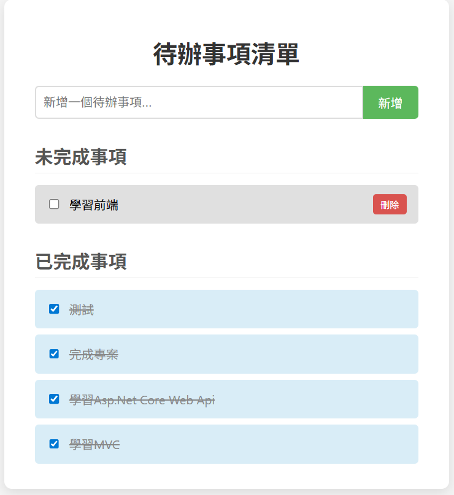

# 專案名稱：待辦事項管理系統 (Todo List Application)

## 專案畫面預覽

## 專案概述

一個前後端分離的 Todo List 應用，實作任務 **新增、查詢、更新與刪除（CRUD）**。  
目標為熟練 **ASP.NET Core Web API 架構、資料庫操作** 與 **前端串接實作流程**。

- 前端：HTML + CSS + JavaScript（Bootstrap 5）
- 後端：ASP.NET Core Web API（C#）
- 資料庫：SQL Server（LocalDB）

## 技術細節

### 後端設計（ASP.NET Core）

- **分層架構**：Controller ➝ Service ➝ Repository ➝ DbContext
- **DTO（資料傳輸物件）**：避免直接暴露資料庫實體。
- **Interface 抽象化**：定義合約，利於測試與擴充。
- **DI 相依性注入**：建構子注入 Service、Repository、DbContext，統一註冊於 `Program.cs`
- **非同步處理**：使用 `async/await` 提升效能與擴充性。
- **API 測試工具**：使用 Postman 驗證 API 行為。

### 前端實作（Vanilla JS）

- 使用 `fetch()` 串接 Web API（GET / POST / PUT / DELETE）
- DOM 操作實現任務互動（新增、完成狀態切換、刪除）
- 搭配 **Bootstrap 5** 實現響應式 UI

## 核心功能

- **新增任務**：輸入任務名稱後加入清單
- **切換任務狀態**：勾選項目後轉換為「已完成 / 未完成」
- **刪除任務**：移除指定待辦項目
- **任務分類顯示**：依據完成狀態自動分組
- **前後端同步**：即時呼叫 API 並更新畫面，確保資料一致性
